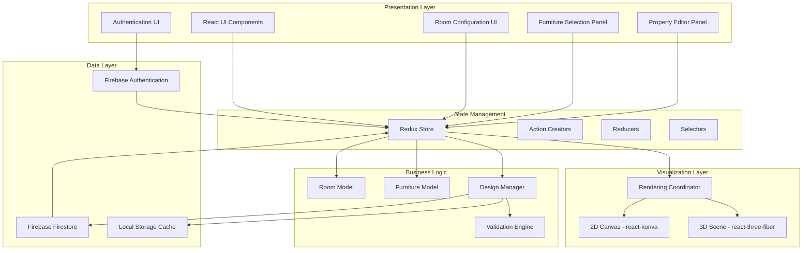

# Design Document: Furniture Design Visualizer

## Overview

The Furniture Design Visualizer is a desktop application built with React and Electron that enables furniture store designers to create, visualize, and manage furniture layouts in virtual rooms. The application provides dual visualization modes (2D and 3D) with real-time synchronization, allowing designers to work in their preferred view while maintaining spatial accuracy.

The system architecture follows a component-based design with clear separation between:
- **Presentation Layer**: React components for UI and user interactions
- **Visualization Layer**: Specialized rendering engines for 2D (react-konva) and 3D (react-three-fiber)
- **State Management Layer**: Redux for centralized application state
- **Data Layer**: Firebase services for authentication and cloud storage
- **Business Logic Layer**: Core domain logic for room modeling, furniture management, and design operations

This design emphasizes real-time interactivity, cross-platform compatibility, and reliable data persistence while maintaining smooth performance on mid-range hardware.

## Architecture

### High-Level Architecture



### Component Architecture

The application is structured into the following major components:

1. **App Shell**: Main Electron window and React root component
2. **Authentication Module**: User registration, login, and session management
3. **Room Configuration Module**: Room creation and property editing
4. **Furniture Library Module**: Furniture piece selection and instantiation
5. **2D Visualization Module**: Canvas-based top-down view with drag-and-drop
6. **3D Visualization Module**: WebGL-based perspective view with camera controls
7. **Property Editor Module**: Sliders and color pickers for furniture customization
8. **Design Management Module**: Save, load, edit, and delete operations
9. **State Synchronization Module**: Ensures consistency between 2D and 3D views

## Components and Interfaces

### 1. Room Model

**Purpose**: Represents a physical room with dimensions, shape, and color scheme.

**Data Structure**:
```typescript
interface Room {
  id: string;
  shape: 'rectangular' | 'square' | 'circular';
  dimensions: {
    width: number;  // in feet
    length: number; // in feet (for rectangular/square)
    radius: number; // in feet (for circular)
  };
  colorScheme: {
    walls: string;   // hex color
    floor: string;   // hex color
    ceiling: string; // hex color
  };
  unit: 'feet' | 'meters';
}
```

**Operations**:
- `createRoom(shape, dimensions, colorScheme, unit): Room`
- `validateDimensions(dimensions): ValidationResult`
- `updateColorScheme(room, colorScheme): Room`
- `convertUnits(room, targetUnit): Room`

**Validation Rules**:
- All dimensions must be positive numbers
- Dimensions must be within bounds: 1-100 feet (or equivalent in meters)
- For rectangular rooms: width and length required
- For square rooms: width required (length = width)
- For circular rooms: radius required
- Color values must be valid hex codes

### 2. Furniture Model

**Purpose**: Represents a furniture piece with type, dimensions, position, and appearance.

**Data Structure**:
```typescript
interface FurniturePiece {
  id: string;
  type: 'chair' | 'table' | 'couch' | 'bed' | 'desk' | 'shelf' | 'cabinet' | 'lamp';
  dimensions: {
    width: number;  // in feet
    depth: number;  // in feet
    height: number; // in feet
  };
  position: {
    x: number; // in feet from room origin
    y: number; // in feet from room origin
    z: number; // in feet (elevation, typically 0)
    rotation: number; // in degrees (0-360)
  };
  color: string; // hex color
  scale: number; // multiplier (0.5-3.0)
}
```

**Operations**:
- `createFurniture(type): FurniturePiece` - Creates with default properties
- `updatePosition(furniture, position): FurniturePiece`
- `updateScale(furniture, scale): FurniturePiece`
- `updateColor(furniture, color): FurniturePiece`
- `validatePosition(furniture, room): ValidationResult`
- `checkCollision(furniture1, furniture2): boolean`

**Default Dimensions by Type**:
- Chair: 2' × 2' × 3'
- Table: 4' × 3' × 2.5'
- Couch: 7' × 3' × 3'
- Bed: 6.5' × 5' × 2'
- Desk: 5' × 2.5' × 2.5'
- Shelf: 3' × 1' × 6'
- Cabinet: 4' × 2' × 5'
- Lamp: 1.5' × 1.5' × 4'

### 3. Design Model

**Purpose**: Represents a complete furniture layout including room and all furniture pieces.

**Data Structure**:
```typescript
interface Design {
  id: string;
  userId: string;
  name: string;
  room: Room;
  furniture: FurniturePiece[];
  createdAt: Date;
  updatedAt: Date;
  version: number;
}
```

**Operations**:
- `createDesign(userId, name, room): Design`
- `addFurniture(design, furniture): Design`
- `removeFurniture(design, furnitureId): Design`
- `updateFurniture(design, furnitureId, updates): Design`
- `validateDesign(design): ValidationResult`

### 4. 2D Visualization Engine

**Purpose**: Renders top-down view of room and furniture using HTML5 Canvas via react-konva.

**Key Components**:
- `Canvas2D`: Main canvas container
- `RoomLayer`: Renders room boundaries and floor
- `FurnitureLayer`: Renders furniture pieces as shapes
- `GridLayer`: Renders measurement grid
- `InteractionLayer`: Handles mouse events for drag-and-drop

**Rendering Strategy**:
- Use orthographic projection (top-down view)
- Scale: 1 foot = 20 pixels (configurable)
- Furniture represented as rectangles/circles with labels
- Color-coded by furniture type
- Drag handles on selected furniture
- Snap-to-grid option for precise placement

**Interface**:
```typescript
interface Canvas2DProps {
  room: Room;
  furniture: FurniturePiece[];
  selectedFurnitureId: string | null;
  onFurnitureMove: (id: string, position: Position) => void;
  onFurnitureSelect: (id: string) => void;
  showGrid: boolean;
  snapToGrid: boolean;
}
```

### 5. 3D Visualization Engine

**Purpose**: Renders perspective view of room and furniture using WebGL via react-three-fiber.

**Key Components**:
- `Scene3D`: Main Three.js scene container
- `RoomMesh`: 3D geometry for room (walls, floor, ceiling)
- `FurnitureMesh`: 3D geometry for each furniture piece
- `CameraController`: Orbit controls for camera manipulation
- `LightingRig`: Ambient and directional lights

**Rendering Strategy**:
- Use perspective camera with orbit controls
- Furniture represented as box geometries with materials
- Room represented as plane geometries for floor/ceiling and box geometries for walls
- Lighting: ambient light + directional light from above
- Anti-aliasing enabled for smooth edges
- Shadow mapping for realistic depth perception

**Camera Controls**:
- Rotation: Click and drag to orbit around scene center
- Zoom: Mouse wheel or pinch gesture
- Pan: Right-click drag or two-finger drag
- Reset: Button to return to default view

**Interface**:
```typescript
interface Scene3DProps {
  room: Room;
  furniture: FurniturePiece[];
  selectedFurnitureId: string | null;
  onFurnitureSelect: (id: string) => void;
  cameraPosition: Vector3;
  onCameraChange: (position: Vector3, target: Vector3) => void;
}
```

### 6. State Management (Redux)

**Purpose**: Centralized state management for application data and UI state.

**State Shape**:
```typescript
interface AppState {
  auth: {
    user: User | null;
    loading: boolean;
    error: string | null;
  };
  design: {
    current: Design | null;
    saved: Design[];
    loading: boolean;
    error: string | null;
    isDirty: boolean;
  };
  ui: {
    selectedFurnitureId: string | null;
    activeView: '2d' | '3d' | 'split';
    showGrid: boolean;
    snapToGrid: boolean;
    sidebarOpen: boolean;
  };
  cache: {
    lastSaved: Date | null;
    autoSaveEnabled: boolean;
  };
}
```

**Key Actions**:
- Authentication: `login`, `logout`, `register`, `authStateChanged`
- Design: `createDesign`, `loadDesign`, `saveDesign`, `deleteDesign`, `updateDesign`
- Room: `updateRoom`, `updateRoomDimensions`, `updateRoomColors`
- Furniture: `addFurniture`, `removeFurniture`, `updateFurniturePosition`, `updateFurnitureScale`, `updateFurnitureColor`
- UI: `selectFurniture`, `setActiveView`, `toggleGrid`, `toggleSnapToGrid`

**Selectors**:
- `getCurrentDesign(state): Design | null`
- `getSelectedFurniture(state): FurniturePiece | null`
- `getFurnitureList(state): FurniturePiece[]`
- `getRoom(state): Room | null`
- `isAuthenticated(state): boolean`
- `isDirty(state): boolean`

### 7. Firebase Integration

**Authentication Service**:
- Email/password authentication
- Session persistence across app restarts
- User profile management

**Firestore Database Structure**:
```
users/
  {userId}/
    profile: { email, displayName, createdAt }
    designs/
      {designId}/
        { name, room, furniture, createdAt, updatedAt, version }
```

**Operations**:
- `authenticateUser(email, password): Promise<User>`
- `registerUser(email, password): Promise<User>`
- `saveDesign(userId, design): Promise<void>`
- `loadDesigns(userId): Promise<Design[]>`
- `updateDesign(userId, designId, design): Promise<void>`
- `deleteDesign(userId, designId): Promise<void>`

**Error Handling**:
- Network errors: Retry with exponential backoff (3 attempts)
- Authentication errors: Clear session and redirect to login
- Permission errors: Display error message to user
- Quota errors: Notify user of storage limits

### 8. Local Cache

**Purpose**: Prevent data loss during network failures or unexpected termination.

**Implementation**:
- Use browser localStorage for persistence
- Cache current design state on every change (debounced 500ms)
- Store timestamp of last successful save
- On app startup, check for unsaved cached design
- Prompt user to restore cached design if found

**Cache Structure**:
```typescript
interface CachedDesign {
  design: Design;
  timestamp: Date;
  lastSavedTimestamp: Date | null;
}
```

## Data Models

### Coordinate System

**2D Coordinate System**:
- Origin (0, 0) at top-left corner of room
- X-axis: increases to the right
- Y-axis: increases downward
- Units: feet (or meters based on user preference)

**3D Coordinate System**:
- Origin (0, 0, 0) at center of room floor
- X-axis: increases to the right
- Y-axis: increases upward (height)
- Z-axis: increases toward viewer
- Units: feet (or meters based on user preference)

**Coordinate Conversion**:
```typescript
function convert2Dto3D(pos2D: {x: number, y: number}, room: Room): Vector3 {
  // Center the 3D coordinates
  const centerX = room.dimensions.width / 2;
  const centerZ = room.dimensions.length / 2;
  
  return {
    x: pos2D.x - centerX,
    y: 0, // furniture sits on floor
    z: pos2D.y - centerZ
  };
}

function convert3Dto2D(pos3D: Vector3, room: Room): {x: number, y: number} {
  const centerX = room.dimensions.width / 2;
  const centerZ = room.dimensions.length / 2;
  
  return {
    x: pos3D.x + centerX,
    y: pos3D.z + centerZ
  };
}
```

### Validation Models

**Dimension Validation**:
- Minimum dimension: 0.5 feet
- Maximum dimension: 20 feet (furniture), 100 feet (room)
- Precision: 0.1 feet

**Position Validation**:
- Furniture must be within room boundaries
- Collision detection uses bounding box intersection
- Warning (not error) for overlapping furniture

**Color Validation**:
- Must be valid hex color code (#RRGGBB or #RGB)
- Alpha channel optional (#RRGGBBAA)

## Correctness Properties

*A property is a characteristic or behavior that should hold true across all valid executions of a system—essentially, a formal statement about what the system should do. Properties serve as the bridge between human-readable specifications and machine-verifiable correctness guarantees.*


### Property 1: Room Creation Accepts Valid Inputs

*For any* valid room shape (rectangular, square, circular) and valid dimensions within bounds (1-100 feet), creating a room should succeed and produce a valid Room object with the specified properties.

**Validates: Requirements 1.1, 1.2**

### Property 2: Dimension Validation Rejects Invalid Inputs

*For any* dimensions that are negative, zero, or outside reasonable bounds (1-100 feet for rooms, 0.5-20 feet for furniture), the validation function should reject them and return a descriptive error message.

**Validates: Requirements 1.5, 1.6, 2.6**

### Property 3: Color Scheme Acceptance

*For any* valid hex color codes, the system should accept them for room color schemes (walls, floor, ceiling) and furniture colors.

**Validates: Requirements 1.4, 2.4**

### Property 4: Furniture Type Instantiation

*For any* supported furniture type (chair, table, couch, bed, desk, shelf), creating a furniture piece should produce a valid FurniturePiece object with appropriate default dimensions and properties.

**Validates: Requirements 2.1, 2.2**

### Property 5: Furniture Property Updates

*For any* furniture piece and valid property updates (dimensions, color, position), applying the updates should produce a new furniture piece with the updated properties while preserving other properties.

**Validates: Requirements 2.3, 2.4**

### Property 6: 2D Rendering Completeness

*For any* room and list of furniture pieces, the 2D rendering function should produce output that includes representations of all furniture pieces in the list.

**Validates: Requirements 3.1**

### Property 7: Furniture Position Updates

*For any* furniture piece and valid position within room boundaries, updating the position should succeed and the furniture should appear at the new position in both 2D and 3D views.

**Validates: Requirements 3.2**

### Property 8: Scale Preservation

*For any* room and furniture pieces, the ratio of furniture dimensions to room dimensions should be preserved consistently between the data model and both 2D and 3D visualizations.

**Validates: Requirements 3.3**

### Property 9: Boundary Validation

*For any* furniture piece and position outside room boundaries, the validation function should reject the position and prevent the furniture from being placed there.

**Validates: Requirements 3.4**

### Property 10: Collision Detection

*For any* two furniture pieces with overlapping bounding boxes, the collision detection function should return true indicating an overlap.

**Validates: Requirements 3.5**

### Property 11: 3D Rendering Completeness

*For any* room and list of furniture pieces, the 3D rendering function should produce a scene that includes mesh representations of all furniture pieces in the list.

**Validates: Requirements 4.1**

### Property 12: Camera Transformation Correctness

*For any* camera position and rotation/zoom/pan command, applying the command should update the camera position according to the expected transformation mathematics.

**Validates: Requirements 4.2, 4.3, 4.4**

### Property 13: 2D-3D Coordinate Round Trip

*For any* valid 2D position within room boundaries, converting to 3D coordinates and back to 2D should produce the original position (within floating-point precision tolerance).

**Validates: Requirements 4.6**

### Property 14: Color Application in 3D

*For any* room with a color scheme, the 3D scene should contain materials with colors matching the room's wall, floor, and ceiling colors.

**Validates: Requirements 4.7**

### Property 15: Proportional Scaling with Aspect Ratio Preservation

*For any* furniture piece and scale factor (0.5-3.0), scaling the furniture should multiply all dimensions by the same factor, preserving the aspect ratio.

**Validates: Requirements 5.2, 5.5**

### Property 16: View Synchronization

*For any* furniture property change (position, scale, color), the change should be reflected in both 2D and 3D views with consistent values.

**Validates: Requirements 5.6**

### Property 17: Design Persistence Round Trip

*For any* valid design, saving it to storage and then loading it back should produce an equivalent design with the same room configuration and furniture pieces.

**Validates: Requirements 6.1, 6.4**

### Property 18: User Association

*For any* saved design, the design should have a userId field that matches the authenticated user who saved it.

**Validates: Requirements 6.2**

### Property 19: User Design Filtering

*For any* user requesting their saved designs, all returned designs should have a userId matching the requesting user's ID.

**Validates: Requirements 6.3**

### Property 20: Design ID Uniqueness

*For any* collection of saved designs, all design IDs should be unique (no duplicates).

**Validates: Requirements 6.5**

### Property 21: Save Failure State Preservation

*For any* design and simulated save failure, the design should remain in memory unchanged and available for retry.

**Validates: Requirements 6.6**

### Property 22: Design Mutability After Load

*For any* loaded design, all room and furniture properties should be modifiable, producing a new design state with the changes.

**Validates: Requirements 7.1**

### Property 23: Design ID Preservation During Updates

*For any* existing design, saving modifications should preserve the original design ID while updating the content and timestamp.

**Validates: Requirements 7.2**

### Property 24: Design Deletion Completeness

*For any* design that is deleted, subsequent attempts to load that design by ID should fail with a "not found" error.

**Validates: Requirements 7.4**

### Property 25: Deletion Failure Preservation

*For any* design and simulated deletion failure, the design should remain in the user's design list and be loadable.

**Validates: Requirements 7.5**

### Property 26: Authorization Access Control

*For any* user, authenticated users should have access to design features while unauthenticated users should be denied access with appropriate error messages.

**Validates: Requirements 8.3, 8.4**

### Property 27: Session Persistence

*For any* authenticated user, the authentication state should persist across application restarts until explicit logout.

**Validates: Requirements 8.6**

### Property 28: Undo Reverses Changes

*For any* furniture operation (add, move, scale, color change) followed by undo, the design state should return to the state before the operation.

**Validates: Requirements 11.4**

### Property 29: Error Messages Presence

*For any* validation error or operation failure, the system should return an error object containing a non-empty descriptive message.

**Validates: Requirements 11.3, 12.6**

### Property 30: Save Verification

*For any* save operation, the system should verify successful persistence by checking the storage service response before returning success to the caller.

**Validates: Requirements 12.1**

### Property 31: Retry Logic on Failure

*For any* save operation that fails due to network error, the system should retry up to 3 times before returning failure.

**Validates: Requirements 12.2**

### Property 32: Local Cache Persistence

*For any* design modification, the change should be written to local cache within a reasonable time window (1 second), ensuring recovery is possible.

**Validates: Requirements 12.3**

### Property 33: Cache Recovery Availability

*For any* cached design, after simulated application restart, the cached design should be available for restoration.

**Validates: Requirements 12.4**

### Property 34: Pre-Save Validation

*For any* design with invalid data (e.g., furniture outside room, invalid dimensions), the save operation should reject the design with a validation error before attempting to persist.

**Validates: Requirements 12.5**

## Error Handling

### Error Categories

1. **Validation Errors**: Invalid user input (dimensions, colors, positions)
2. **Authentication Errors**: Login failures, session expiration, permission denied
3. **Network Errors**: Connection failures, timeouts, service unavailable
4. **Storage Errors**: Save/load failures, quota exceeded, data corruption
5. **Rendering Errors**: WebGL context loss, canvas errors, resource loading failures

### Error Handling Strategy

**Validation Errors**:
- Validate input immediately on change
- Display inline error messages near the input field
- Prevent invalid operations from executing
- Provide suggestions for correction (e.g., "Dimension must be between 1 and 100 feet")

**Authentication Errors**:
- Clear local session state on authentication failure
- Redirect to login page with error message
- Preserve current work in local cache before redirect
- Offer to restore work after successful re-authentication

**Network Errors**:
- Implement exponential backoff retry (3 attempts: 1s, 2s, 4s delays)
- Display toast notification for transient errors
- Offer manual retry button for persistent errors
- Cache operations locally and sync when connection restored

**Storage Errors**:
- Validate data before save attempt
- Maintain local backup of last successful save
- Display detailed error message with recovery options
- For quota errors, suggest deleting old designs

**Rendering Errors**:
- Implement WebGL context loss recovery
- Fall back to 2D view if 3D rendering fails
- Display error message with browser/driver update suggestions
- Log errors for debugging

### Error Recovery Mechanisms

1. **Auto-save**: Save to local cache every 30 seconds
2. **Manual save**: Explicit save button with confirmation
3. **Crash recovery**: Detect unsaved work on startup and offer restoration
4. **Offline mode**: Allow design work without network, sync when online
5. **Undo/Redo**: Maintain operation history for reverting mistakes

### 9. User Profile Management

**Purpose**: Allow users to view and edit their profile information and account settings.

**Data Structure**:
```typescript
interface UserProfile {
  userId: string;
  displayName: string;
  email: string;
  phone?: string;
  location?: string;
  bio?: string;
  avatarUrl?: string;
  settings: {
    emailNotifications: boolean;
    autoSave: boolean;
    marketingEmails: boolean;
  };
  createdAt: Date;
  updatedAt: Date;
}
```

**Components**:
- `ProfilePage`: Main profile page container
- `ProfileCard`: Displays and edits user information
- `ProfileStats`: Shows user statistics (designs, furniture, membership)
- `AccountSettings`: Toggleable settings for notifications and preferences
- `DangerZone`: Account deletion functionality

**Operations**:
- `updateProfile(userId, updates): Promise<void>`
- `updateSettings(userId, settings): Promise<void>`
- `deleteAccount(userId): Promise<void>`
- `uploadAvatar(userId, file): Promise<string>`

### 10. Reviews and Ratings System

**Purpose**: Allow users to submit and view reviews about the application.

**Data Structure**:
```typescript
interface Review {
  id: string;
  userId: string;
  userName: string;
  userEmail: string;
  rating: number; // 1-5
  comment: string;
  date: Date;
  helpful: number; // count of helpful votes
}

interface ReviewStats {
  averageRating: number;
  totalReviews: number;
  distribution: {
    5: number;
    4: number;
    3: number;
    2: number;
    1: number;
  };
}
```

**Components**:
- `ReviewsPage`: Main reviews page container
- `OverallRatingCard`: Displays average rating and distribution
- `ReviewForm`: Form for submitting new reviews
- `ReviewsList`: Displays all reviews with pagination
- `ReviewCard`: Individual review display with stars and comment
- `StarRating`: Reusable star rating component (display and interactive modes)

**Operations**:
- `submitReview(review): Promise<void>`
- `loadReviews(): Promise<Review[]>`
- `calculateStats(reviews): ReviewStats`
- `markHelpful(reviewId): Promise<void>`

### 11. Contact and Support

**Purpose**: Provide users with a way to contact support and view contact information.

**Data Structure**:
```typescript
interface ContactMessage {
  id: string;
  userId: string;
  name: string;
  email: string;
  subject: string;
  message: string;
  status: 'pending' | 'responded' | 'resolved';
  createdAt: Date;
}

interface ContactInfo {
  email: string;
  phone: string;
  address: string;
  businessHours: string;
}
```

**Components**:
- `ContactPage`: Main contact page container
- `ContactForm`: Form for submitting contact messages
- `ContactInfo`: Displays support contact information
- `SuccessMessage`: Confirmation message after form submission

**Operations**:
- `submitContactMessage(message): Promise<void>`
- `getContactInfo(): ContactInfo`

### 12. Navigation and Routing

**Purpose**: Provide seamless navigation between different pages of the application.

**Routes**:
- `/` - Redirects to `/designs`
- `/login` - Login page (public)
- `/register` - Registration page (public)
- `/designs` - Design list/dashboard (protected)
- `/editor` - Design editor (protected)
- `/profile` - User profile (protected)
- `/reviews` - Reviews page (protected)
- `/contact` - Contact page (protected)

**Sidebar Navigation**:
- Dashboard (📊) - Links to `/designs`
- My Designs (📁) - Links to `/designs`
- Reviews (⭐) - Links to `/reviews`
- Profile (👤) - Links to `/profile`
- Contact (📧) - Links to `/contact`

## Testing Strategy

### Dual Testing Approach

The application will use both unit testing and property-based testing to ensure comprehensive coverage:

**Unit Tests**: Focus on specific examples, edge cases, and integration points
- Specific room configurations (rectangular 10x12, circular radius 8, etc.)
- Edge cases (minimum/maximum dimensions, boundary positions)
- Error conditions (network failures, invalid inputs)
- Component integration (Redux actions, Firebase calls)
- UI component rendering (React component tests)

**Property Tests**: Verify universal properties across all inputs
- Run minimum 100 iterations per property test
- Use random generation for rooms, furniture, positions, colors
- Test invariants that should hold for all valid inputs
- Validate round-trip operations (save/load, 2D/3D conversion)
- Ensure validation rules are consistently applied

**Balance**: Avoid writing excessive unit tests for cases covered by property tests. Unit tests should focus on specific scenarios that demonstrate correct behavior, while property tests handle comprehensive input coverage.

### Property-Based Testing Configuration

**Library**: Use `fast-check` for JavaScript/TypeScript property-based testing

**Configuration**:
- Minimum 100 iterations per property test
- Seed-based reproducibility for failed tests
- Shrinking enabled to find minimal failing cases
- Timeout: 5 seconds per property test

**Test Tagging**: Each property test must reference its design document property:
```typescript
// Feature: furniture-design-visualizer, Property 1: Room Creation Accepts Valid Inputs
test('room creation accepts valid inputs', () => {
  fc.assert(
    fc.property(
      roomShapeArbitrary(),
      dimensionsArbitrary(),
      (shape, dimensions) => {
        const result = createRoom(shape, dimensions);
        expect(result).toBeDefined();
        expect(result.shape).toBe(shape);
      }
    ),
    { numRuns: 100 }
  );
});
```

### Test Coverage Goals

- **Unit Test Coverage**: Minimum 80% code coverage
- **Property Test Coverage**: All 34 correctness properties implemented
- **Integration Test Coverage**: All major user workflows (create, save, load, edit, delete)
- **E2E Test Coverage**: Critical paths (authentication, design creation, persistence)

### Testing Tools

- **Unit Testing**: Jest + React Testing Library
- **Property Testing**: fast-check
- **E2E Testing**: Playwright or Cypress
- **Visual Regression**: Percy or Chromatic (for UI consistency)
- **Performance Testing**: Lighthouse (for rendering performance)

### Continuous Integration

- Run all tests on every pull request
- Block merges if tests fail or coverage drops
- Run property tests with increased iterations (1000) on main branch
- Performance benchmarks on main branch to detect regressions
